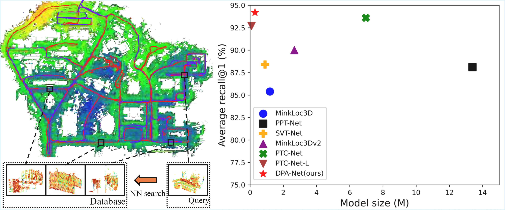
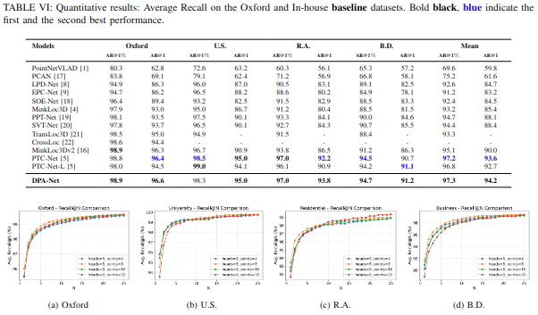
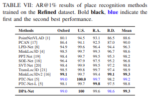
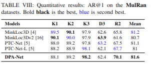
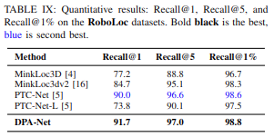
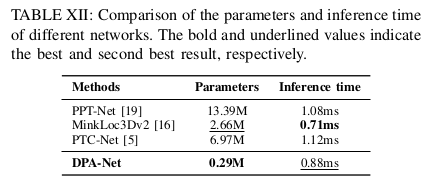
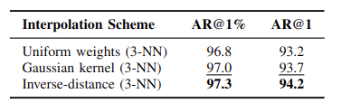

# DPA-net: Deformable-Point-Attention-for-LiDAR-Place-Recognition-with-Weighted-GeM-Aggregation

by  MinSeo Park

### Abstract
We present DPA-Net, a lightweight yet highly dis- criminative LiDAR place recognition network that combines sparse 3D convolution with deformable point-based attention. Unlike conventional voxel-based architectures that suffer from in- formation loss during quantization, DPA-Net reconstructs dense point features through an interpolation module and applies Deformable Point Attention (DPA) to adaptively aggregate ge- ometric structures. The proposed attention mechanism predicts position-aware offsets, samples local key–value features through a single 3-NN interpolation step, and incorporates relative posi- tional encoding to enhance spatial sensitivity while maintaining computational efficiency. A top-down feature propagation module further refines point-wise features by injecting high-level con- textual information back to the original point distribution. A Weighted Generalized Mean Pooling aggregates the refined point features into a global descriptor for retrieval. Experiments con- firm that DPA-Net achieves competitive performance compared to existing point-based and voxel-based LiDAR place recognition methods.



### Oxford & In-house (Baseline Setting)


---

### Refined Setting


---

### MulRan Benchmark


---

### RoboLoc Benchmark


---

### Model Efficiency


### Ablation Study


### Datasets
mulran and roboloc datasets can be downloaded here:

🔗 [Download Dataset (Google Drive)](https://drive.google.com/file/d/1oEZM8DefCMjBRvc2wc_GnhBF33iQ6PNw/view?usp=sharing)

* Oxford dataset
* NUS (in-house) Datasets
  * university sector (U.S.)
  * residential area (R.A.)
  * business district (B.D.)
* Mulran dataset
* roboloc dataset

Following [PointNetVLAD](https://arxiv.org/abs/1804.03492) the datasets can be downloaded [here](https://drive.google.com/open?id=1H9Ep76l8KkUpwILY-13owsEMbVCYTmyx).
Run the below code to generate pickles with positive and negative point clouds for each anchor point cloud. 

```generate pickles
cd generating_queries/ 

# Generate training tuples for the Baseline Dataset
python generate_training_tuples_baseline.py --dataset_root <dataset_root_path>

# Generate training tuples for the Refined Dataset
python generate_training_tuples_refine.py --dataset_root <dataset_root_path>

# Generate evaluation tuples
python generate_test_sets.py --dataset_root <dataset_root_path>
```
`<dataset_root_path>` is a path to dataset root folder, e.g. `/data/pointnetvlad/benchmark_datasets/`.
Before running the code, ensure you have read/write rights to `<dataset_root_path>`, as training and evaluation pickles
are saved there. 

### Training and Evaluation
Note that our training code refers to PTCnet. For more details of the training code please refer to [here](https://github.com/LeegoChen/PTC-Net).

For training and evaluation on the **RoboLoc dataset**, please replace the default dataset loader with:

- `base_datasets_ajou.py`
- `pnv_raw_ajou.py`

These files contain the dataset configuration and loading pipeline adapted for the RoboLoc benchmark.

#### Acknowledgement

Our code refers to
[PTCnet](https://github.com/LeegoChen/PTC-Net),
[PointNetVLAD](https://github.com/mikacuy/pointnetvlad), 
[MinkLoc3Dv2](https://github.com/jac99/MinkLoc3Dv2) 
and [PPT-Net](https://github.com/fpthink/PPT-Net).
