# DPA-Net: Deformable Point Attention for LiDAR Place Recognition With Weighted GeM Aggregation

**Minseo Park, JungWoo Kim, Jaejin Jeon, DoHyeong Kwon, SangHyun Lee, and Soomok Lee**

[](https://ieeexplore.ieee.org/abstract/document/11495515)
[](https://doi.org/10.1109/LRA.2026.3688389)

Official implementation of  
**Deformable Point Attention for LiDAR Place Recognition With Weighted GeM Aggregation**,  
published in **IEEE Robotics and Automation Letters (RA-L), 2026**.

📄 **Paper:** [IEEE Xplore](https://ieeexplore.ieee.org/abstract/document/11495515)  
🔗 **DOI:** [10.1109/LRA.2026.3688389](https://doi.org/10.1109/LRA.2026.3688389)

---

## News

- **[2026.06]** DPA-Net has been published in **IEEE Robotics and Automation Letters (RA-L)**.

---

## Abstract

We present **DPA-Net**, a lightweight yet highly discriminative LiDAR place recognition network that combines sparse 3D convolution with deformable point-based attention. Unlike conventional voxel-based architectures that suffer from information loss during quantization, DPA-Net reconstructs dense point features through an interpolation module and applies **Deformable Point Attention (DPA)** to adaptively aggregate geometric structures.

The proposed attention mechanism predicts position-aware offsets, samples local key–value features through a single 3-NN interpolation step, and incorporates relative positional encoding to enhance spatial sensitivity while maintaining computational efficiency. A top-down feature propagation module further refines point-wise features by injecting high-level contextual information back to the original point distribution. Finally, **Weighted Generalized Mean Pooling** aggregates the refined point features into a global descriptor for retrieval.

Experiments confirm that DPA-Net achieves competitive performance compared to existing point-based and voxel-based LiDAR place recognition methods.

---

## Overview

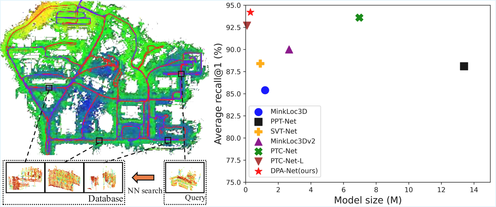

---

## Results

### Oxford & In-house Benchmark — Baseline Setting

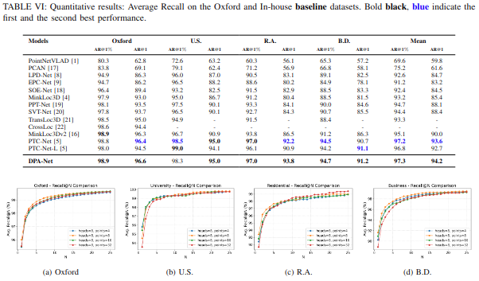

---

### Oxford & In-house Benchmark — Refined Setting

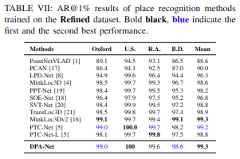

---

### MulRan Benchmark

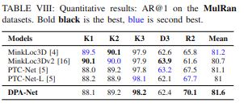

---

### RoboLoc Benchmark

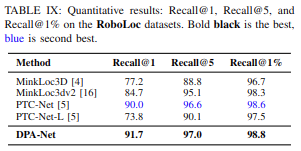

---

## Model Efficiency

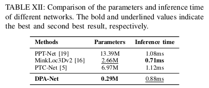

---

## Ablation Study

### Interpolation Scheme in the DPA Module

Ablation study on different interpolation schemes in the DPA module.  
Inverse-distance weighting achieves the best performance compared to uniform and Gaussian weighting.  
The bold and underlined values indicate the best and second-best results, respectively.

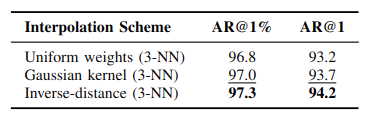

---

### Hyperparameter Sensitivity

Sensitivity analysis of key hyperparameters.  
Recall@1 (%) is reported on the baseline datasets.  
Bold black and blue indicate the best and second-best performance, respectively.

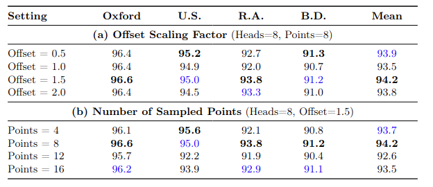

---

## Retrieval Visualization

We provide representative successful and failure retrieval cases produced by **our DPA-based model** on the baseline datasets.

Each figure contains:

- **Left:** Query scan
- **Middle:** Top-1 retrieval result
- **Right:** Closest true positive (TP)

where:

- **d:** embedding distance
- **wd:** world distance in meters

---

### Successful Retrieval Examples

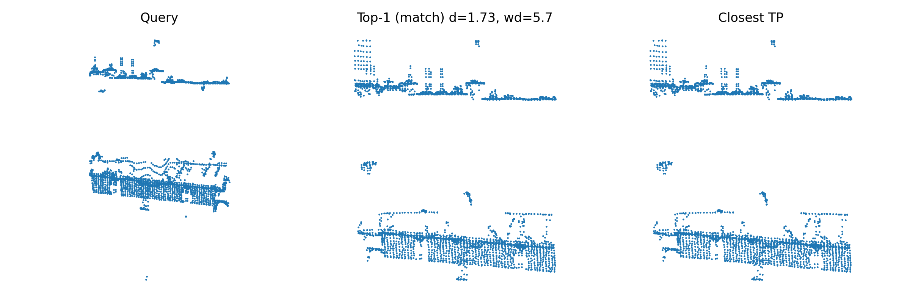

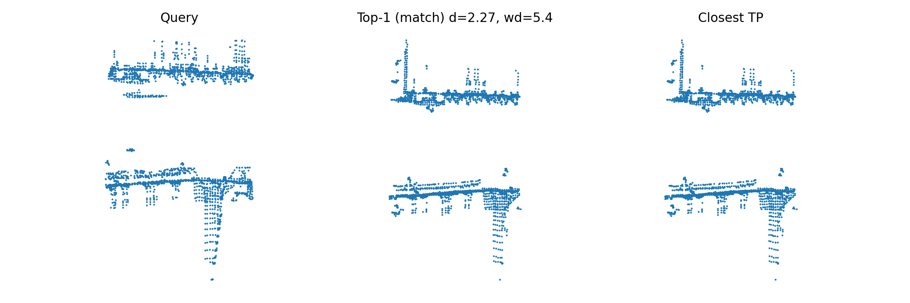

---

### Failure Retrieval Examples

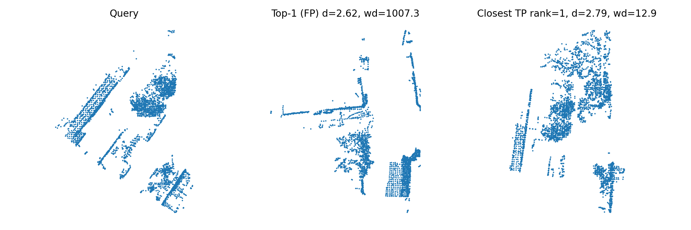

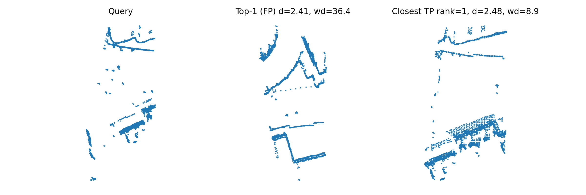

---

## DPA vs. Fixed kNN Attention Comparison

We compare retrieval results between:

- **DPA (Ours)**
- **Fixed kNN Attention**

Each comparison uses the same query scan.

---

### Case 1 — Query q15

| DPA (Ours) | Fixed kNN Attention |
|------------|---------------------|
| 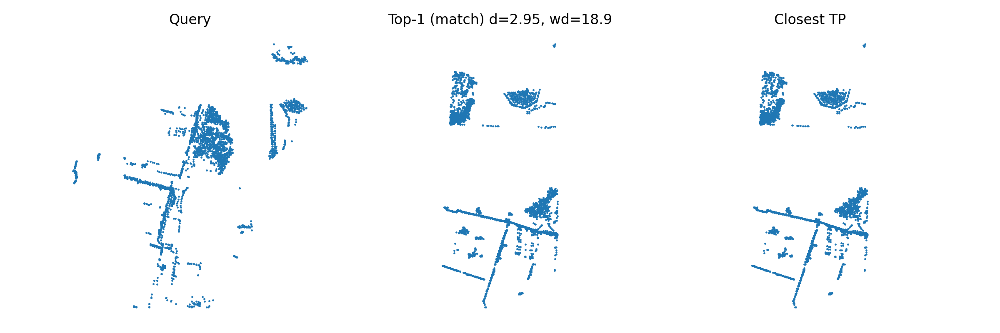 | 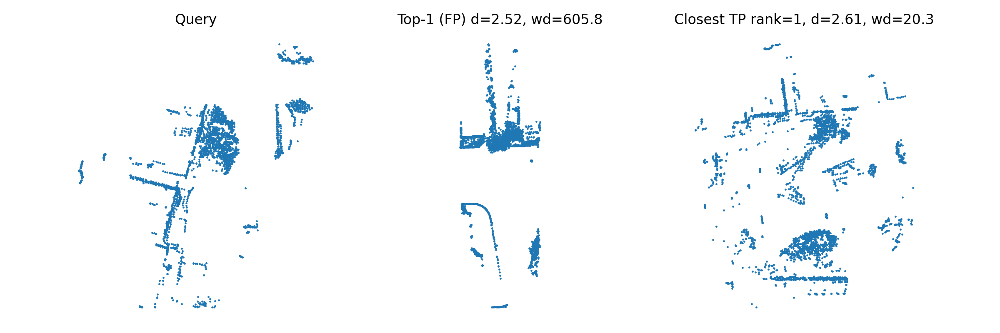 |

---

### Case 2 — Query q40

| DPA (Ours) | Fixed kNN Attention |
|------------|---------------------|
| 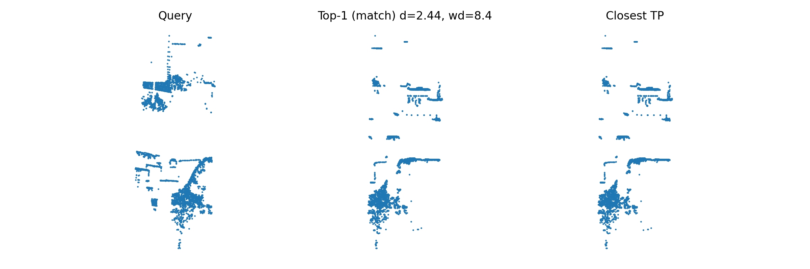 | 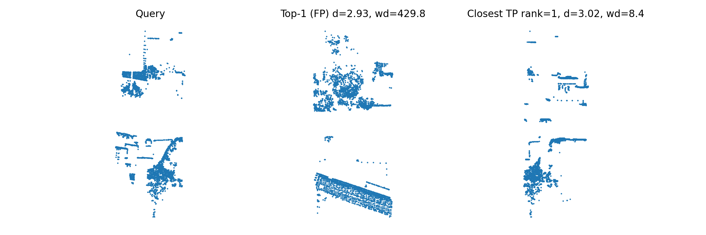 |

---

### Case 3 — Query q67

| DPA (Ours) | Fixed kNN Attention |
|------------|---------------------|
| 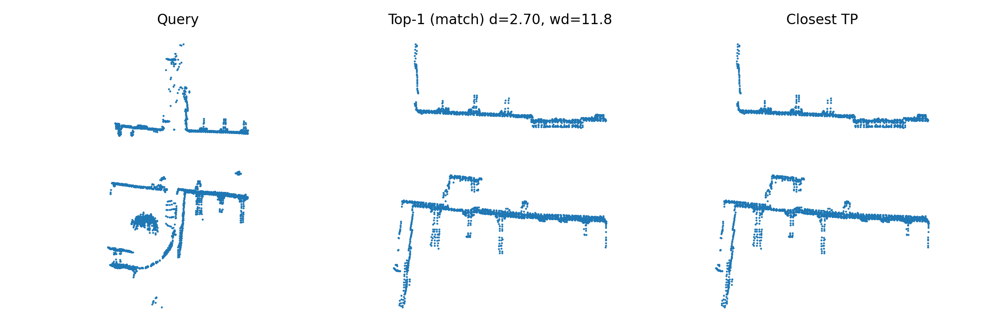 | 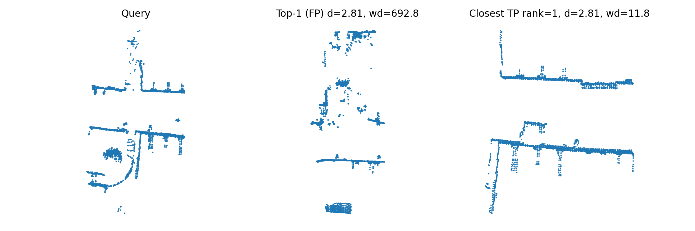 |

---

## Datasets

The MulRan and RoboLoc datasets can be downloaded here:

🔗 [Download Dataset — Google Drive](https://drive.google.com/file/d/1oEZM8DefCMjBRvc2wc_GnhBF33iQ6PNw/view?usp=sharing)

We use the following datasets:

- Oxford dataset
- NUS in-house datasets
  - University sector (U.S.)
  - Residential area (R.A.)
  - Business district (B.D.)
- MulRan dataset
- RoboLoc dataset

Following [PointNetVLAD](https://arxiv.org/abs/1804.03492), the Oxford and NUS in-house datasets can be downloaded [here](https://drive.google.com/open?id=1H9Ep76l8KkUpwILY-13owsEMbVCYTmyx).

To generate training and evaluation pickles with positive and negative point clouds for each anchor point cloud, run:

```bash
cd generating_queries/

# Generate training tuples for the Baseline Dataset
python generate_training_tuples_baseline.py --dataset_root <dataset_root_path>

# Generate training tuples for the Refined Dataset
python generate_training_tuples_refine.py --dataset_root <dataset_root_path>

# Generate evaluation tuples
python generate_test_sets.py --dataset_root <dataset_root_path>
```

`<dataset_root_path>` is the path to the dataset root folder, for example:

```bash
/data/pointnetvlad/benchmark_datasets/
```

Before running the code, make sure you have read/write permission for `<dataset_root_path>`, since the training and evaluation pickle files will be saved there.

---

## Training and Evaluation

Our training code refers to **PTC-Net**.  
For more details about the training code, please refer to the official [PTC-Net repository](https://github.com/LeegoChen/PTC-Net).

For training and evaluation on the **RoboLoc dataset**, please replace the default dataset loader with:

- `base_datasets_ajou.py`
- `pnv_raw_ajou.py`

These files contain the dataset configuration and loading pipeline adapted for the RoboLoc benchmark.

---

## Citation

If you find this work useful for your research, please consider citing:

```bibtex
@ARTICLE{11495515,
  author={Park, Minseo and Kim, JungWoo and Jeon, Jaejin and Kwon, DoHyeong and Lee, SangHyun and Lee, Soomok},
  journal={IEEE Robotics and Automation Letters},
  title={Deformable Point Attention for LiDAR Place Recognition With Weighted GeM Aggregation},
  year={2026},
  volume={11},
  number={6},
  pages={7540-7547},
  keywords={Feeds;Antennas;Filtering;Filters;Location awareness;Media Access Control;Radio access networks;Regional area networks;Protocols;Mobile communication;Point place recognition;3D sparse convolution},
  doi={10.1109/LRA.2026.3688389}
}
```

---

## Acknowledgement

Our code refers to the following repositories:

- [PTC-Net](https://github.com/LeegoChen/PTC-Net)
- [PointNetVLAD](https://github.com/mikacuy/pointnetvlad)
- [MinkLoc3Dv2](https://github.com/jac99/MinkLoc3Dv2)
- [PPT-Net](https://github.com/fpthink/PPT-Net)

We sincerely thank the authors for their excellent work.
